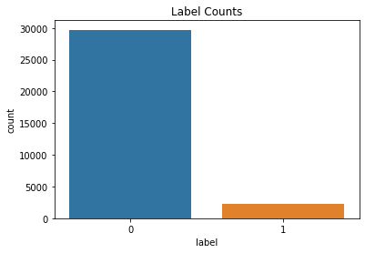
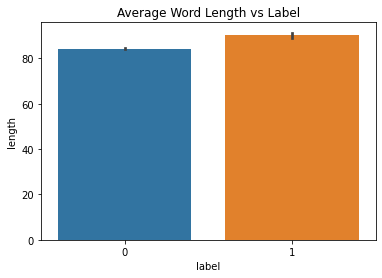

# Twitter Sentiment Analysis
It is a Natural Language Processing Problem where Sentiment Analysis is done by Classifying the Positive tweets from negative tweets by machine learning models for classification, text mining, text analysis, data analysis and data visualization.

## Introduction
The objective of this task is to detect hate speech in tweets. For the sake of simplicity, we say a tweet contains hate speech if it has a racist or sexist sentiment associated with it. So, the task is to classify racist or sexist tweets from other tweets.

Formally, given a training sample of tweets and labels, where label ‘1’ denotes the tweet is racist/sexist and label ‘0’ denotes the tweet is not racist/sexist, your objective is to predict the labels on the given test dataset. Since it is a supervised learning task we are provided with a training data set which consists of Tweets labeled with “1” or “0” and a test data set without labels.
* label “0”: Positive Sentiment
* label “1”: Negative Sentiment

The preprocessing of the text data is an essential step as it makes the raw text ready for mining, i.e., it becomes easier to extract information from the text and apply machine learning algorithms to it. If we skip this step then there is a higher chance that you are working with noisy and inconsistent data. The objective of this step is to clean noise those are less relevant to find the sentiment of tweets such as punctuation, special characters, numbers, and terms which don’t carry much weightage in context to the text.

## Exploratory Data Analysis
  

The above two graphs tell us that the given data is an imbalanced one with very less amount of “1” labels and the length of the tweet doesn’t play a major role in classification.

## Data preprocessing and Feature Engineering
The given data sets are comprised of very much unstructured tweets which should be preprocessed to make an NLP model. In this project, we tried out the following techniques of preprocessing the raw data. But the preprocessing techniques is not limited.
* Removal of punctuations.
* Removal of commonly used words (stopwords).
* Normalization of words.

## Model Selection
Before we let our data to train we have to numerically represent the preprocessed data. So, we have vectorized our sting data to numerical values using Count Vectorization and Tf-Idf in order to feed it to a machine learning algorithm. We choose naive bayes classifier for this binary classification since it is the most common algorithm used in NLP.

## Model Validation
Accuracy is measured using the built-in function of scikit-learn, confusion matrix and classification report.
An accuracy of 0.93962 is obtained for our pipelined model of Count Vectorization, Tf-Idf and Naive Bayes.
